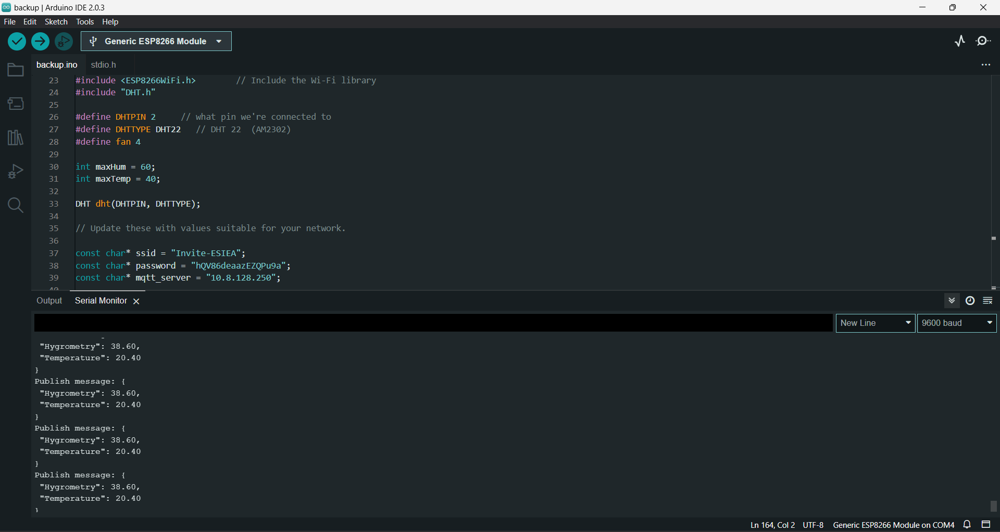
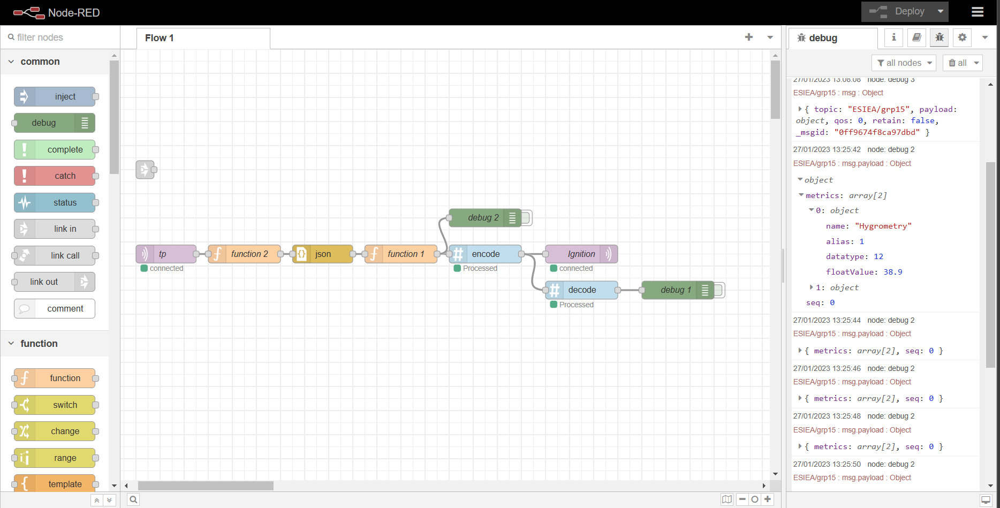
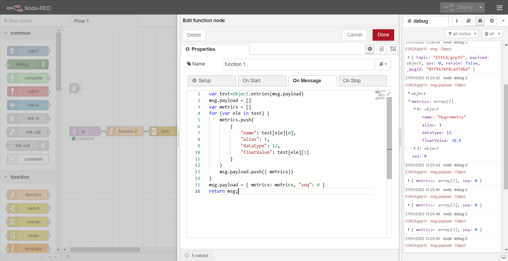
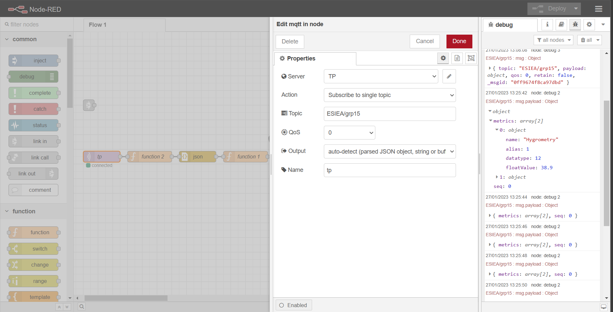
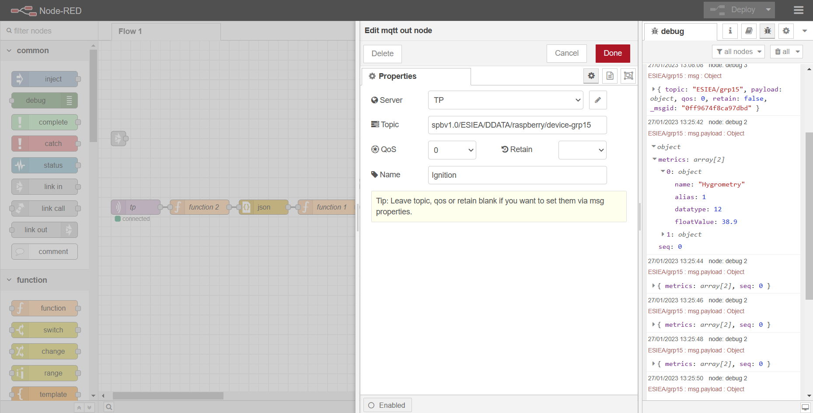
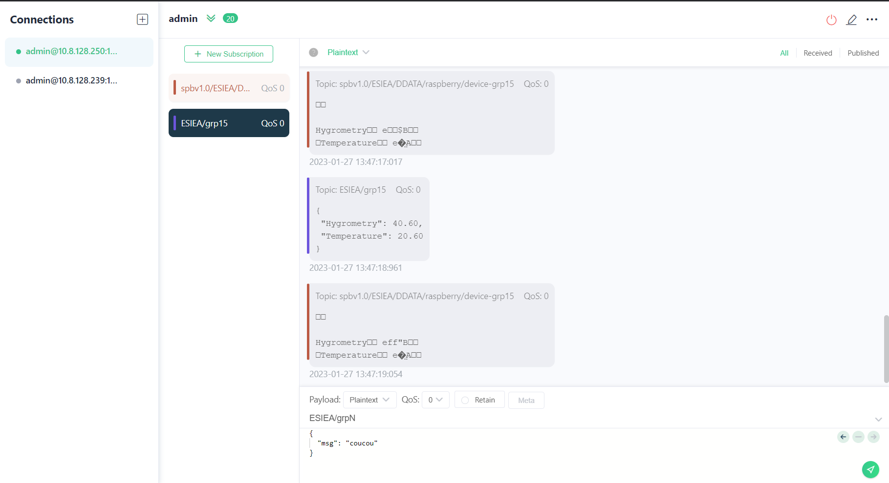
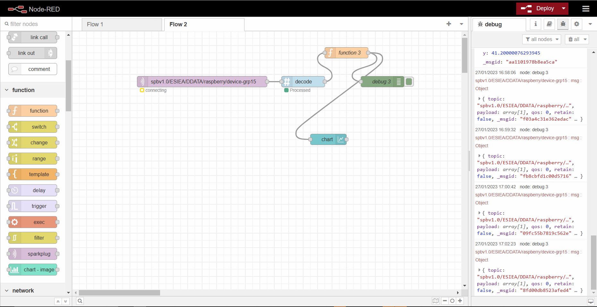
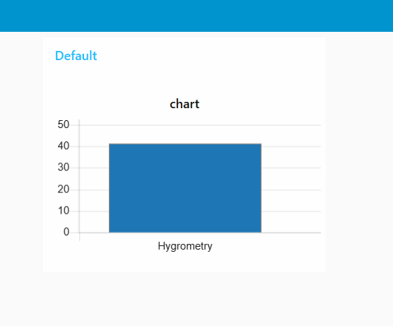

# Rapport TP_industrie_4.0_grp15
<b> 
  ## Étudiants:  
  * MORIN Florian  
  * PTIT HADDAD Raphaël   
  * RANNOU Kilian  
  * SY Moustapha 
</b>
  
<b> <h2> Arduino IDE :</h2> </b>

<b> <h2> NodeRed :</h2> </b>

